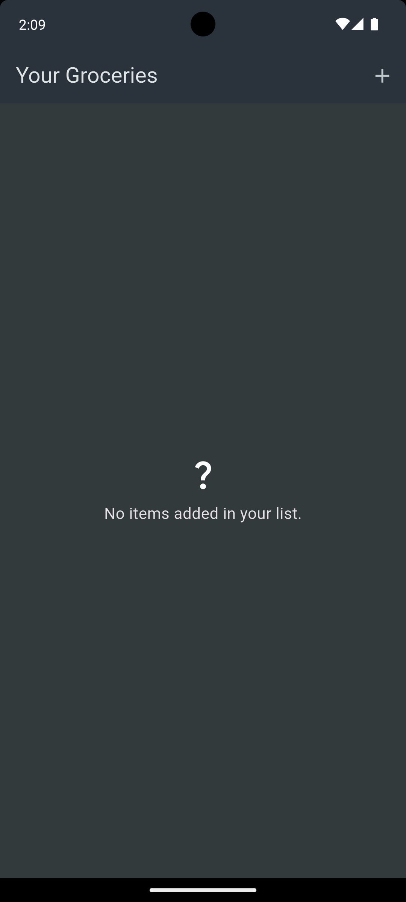
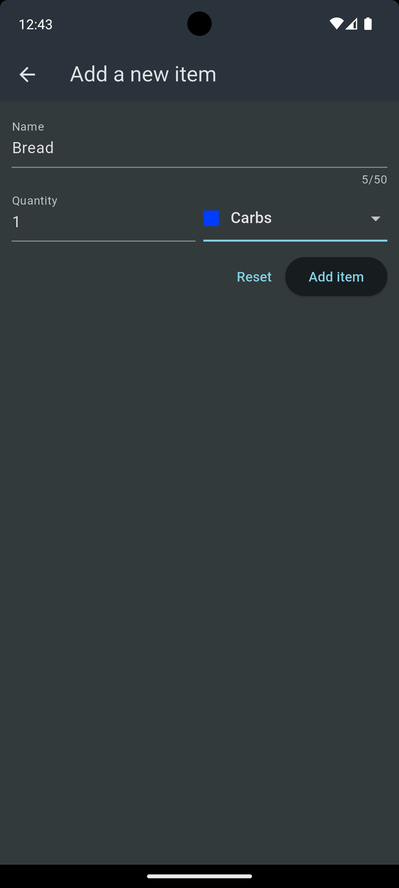
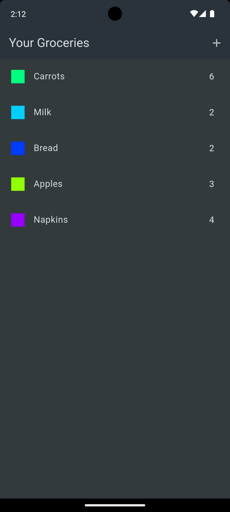
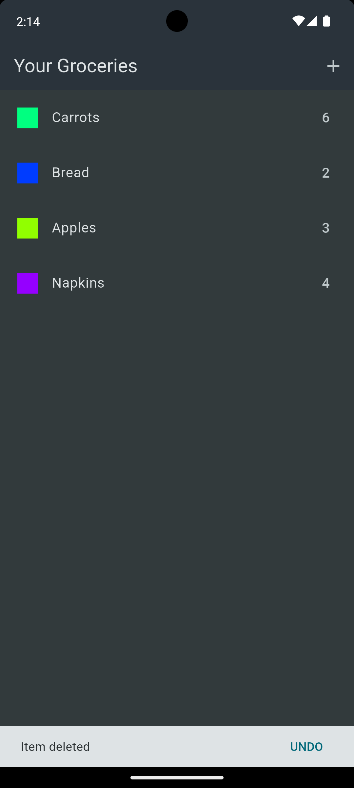

# Shopping list app

## Table of Contents
- [Introduction](#introduction)
- [Features](#features)
- [Technologies Used](#technologies-used)
- [Setup Instructions](#setup-instructions)
- [Usage](#usage)
- [Screenshots](#screenshots)
- [Credits](#credits)
- [Contact](#contact)

## Introduction
A Flutter project that provides an interface to add/delete shopping items of different categories by saving these items in a Firebase realtime database. Project was made as a part of course while learning.

## Features
- **Add item:** Allows for addition of shopping items.
- **Delete items:** User can also delete items.

## Technologies Used
- **Flutter:** Framework and its various packages.
- **Dart:** Primary programming language.
- **Firebase:** Provides backend like services for Flutter by storing items in realtime database.

## Setup Instructions
1. **Install Flutter and Android Studio:**
    Make sure you have the necessary requirements to run a Flutter app on your local machine. Flutter framework, its extensions in VS Code, Android Studio, android emulator (from Android Studio) to run your apps and see them how they look on screens (Alternatively, you can run apps on your actual mobile devices too).

2. **Clone the repository:**
   Type the following commands in your terminal after you have directed it to a particular directory.
   
   - git clone https://github.com/amaanshaikh2114/shopping_list.git

    
## Usage
1. **Create a Firebase realtime database:**
    Go to Firebase console, create a new project and search for Realtime database option in Build category. Create one database and note down it's url without the https:// in this format
    'flutter-your-realtime-firebase-url.firebaseio.com'
2. **Replace the URL in files:**
    Replace the first URL in Uri.https() function in grocery_list.dart and new_item.dart files with your actual Firebase realtime database URL.  
3. **Run the application:**
    Go to the directory where you have placed the project and type 'flutter run' in the terminal. Ensure flutter is recognized by your system by making sure it's in the 'Path' option of System variables by going      to the environment variables of your system.
4. **Add expense:**
    Use the '+' button to open the item adding sheet and you can enter the title, quantity and category of item. Then click 'Add item' button.
5. **Delete expense:**
    To delete an expense swipe the item dismissible tile left/right.

## Screenshots

  
  
  
  

## Credits
'Flutter & Dart - The Complete Guide [2024 Edition]' Course by Maximilian Schwarzmüller on Udemy.

## Contact
For any questions or inquiries, please contact [Amaan Shaikh](mailto:amaanmazhar211@gmail.com). Send a mail to amaanmazhar211@gmail.com
